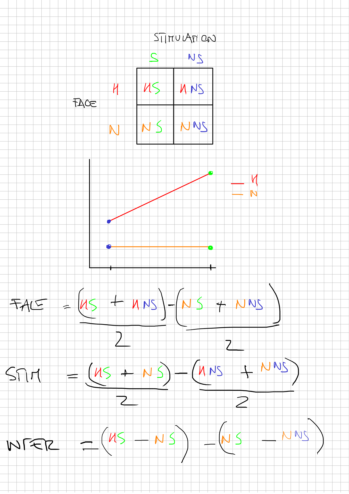

```{r setup, include=FALSE}
knitr::opts_chunk$set(echo = TRUE,
                      message = FALSE,
                      warning = FALSE,
                      dev = "svg",
                      fig.retina = 2,
                      fig.align = "center")
```

```{r packages}
library(tidyverse)
```

# Introduction

The idea of this report is to summarize the approach used to compute the **Bayesian Design Analysis** for a repeated measure ANVOA. The main problem is that the `BFDA` package (https://github.com/nicebread/BFDA) has not yet implemented the ANOVA BFDA. On the other side, The `BayesFactor` package (https://github.com/richarddmorey/BayesFactor), that is the computational core of the `BFDA` package, can run Bayesian ANOVA for testing main effects and interactions. So the main idea is to:

1. simulate repeated-measures data according to our expectations
2. manually implement the `BFDA`
3. computing all relevant parameters

## `BFDA`

There are several options of BFDA. The most interesting is the *sequential Bayes factor with maximal n*. The idea is to specific both a Bayes Factor threshold (e.g., 6) and a max sample size. While the former is arbitrary (e.g., Cortex require a BF of 6 or 1/6) the latter concerns lab resources in terms of money, time, etc.
In order to perform this BFDA we need a target effect size. In our case is the `face:stimolation` interaction where we expect a greater impact of the stimulation (higher *cumulative time*) for *happy* faces compared to *neutral* faces. The Figure \@ref(fig:expected-res) represent our expected results.

```{r expected-res, fig.cap="Expected results", echo = FALSE}
exp_plot <- expand_grid(face = c("h", "n"),
                        stimolation = c("s", "ns"))

exp_plot$ct <- c(0.5, 0.1, 0, 0)
exp_plot %>% 
    ggplot(aes(x = stimolation, y = ct, group = face, color = face)) +
    geom_point(size = 4) +
    geom_line(size = 1) +
    theme_minimal(base_size = 20)
```

So we expect a main effect of `Face` condition (higher cumulative time for Happy faces) and interaction between `Face` and `Stimulation`. Given that the expected effect for the `Stimulation` should be more challenging to find, we will base our BFDA on this effect. The logic 
doing a power analysis for the smallest effect size of interest or the smallest effect size of our analysis. If we have a high-power experiment for detecting the interaction, the main effect is not a problem.

# Data simulation

The first challenge is to simulate data according to our expectations. I've decided to simulate data under some assumptions:

- **homoscedasticity**: variances in all conditions are the same. In order to setup the simulation I've used variances of 1 so we can directly think about standardized differences (e.g., Cohen's d)
- **compound symmetry**: the correlations between conditions are the same. Given that we have *repeated-measures* data we need to simulate that conditions are correlated because the same participants are observed in multiple cells. The correlation is also crucial for the power calculation because the power increase if the correlation is higher.

The second challenge is to simulate data fixing the desired effect size. In our case:

- the main effect of `Face`: I've used 0.5 in terms of Cohen's $d$ representing a medium effect
- the interaction between `Face` and `Stimulation`: I've used 0.2 in terms of Cohen's $f$ representing a medium-small effect
- the correlation $\rho$ between condition is fixed to $\rho = 0.5$

In order to simulate data according to the effect size I've fixed the Stimulation conditions for Neutral faces to 0. In this way the main effect and the interaction will be determined by the other two cells.

Using some simple linear algebra we can setup a formula that allow to calculate the two non-zero cells from the desired main effect and interaction values. Figures \@ref(fig:alg1) and \@ref(fig:alg1) reports all used formulas.

```{r alg1, fig.cap="Part 1 of linear algebra for the effect size", echo = FALSE}

```

```{r alg2, fig.cap="Part 1 of linear algebra for the effect size", echo = FALSE}

```

The third challenge (related to the previous point) is to simulate data directly on the Cohen's $f$ scale. In this case I used a brute force approach fixing the main effect value to 0.5 and finding the cell values that returns our desired effect size (see the `find_optimal_int()` function). For analytically calculation of the Cohen's $f$ I've used the formulae from Zhang & Yuan [-@zhang2018practical].

Finally we decided our prior distributions. Schönbrodt and Wagenmakers [@Schonbrodt2018-ps] distinguish between **design** and **analysis** priors. The design priors represents our beliefs about the effect before collecting data. For example we can say that we expect a medium effect for the interaction (e.g., $f = 0.2$) but with some variability. Then we can average across all simulations in order to find an average sample size considering a distribution of plausible effects. The analysis priors are the priors used to calculate the Bayes Factor. As design prior for the interaction we can use an informed prior (i.e., centered on a certain value) with some uncertainty. In our case we can use a Gaussian distribution $f_{int}\sim Normal(0.2, 0.05)$. Our uncertainty for the interaction effect can be easily represented in Figure \@ref(fig:es).

```{r es, fig.cap = "Prior distribution for the interaction effect", echo = FALSE}
curve(dnorm(x, 0.2, 0.05), 0.2 - 0.05*4, 0.2 + 0.05*4)
```


## Simulation Workflow

For our `BFDA` sampling plan we need a maximum $n$ that represents our sample size upper limit that when reached will stop our data collection regardless the Bayes Factor value. We used a maximum sample size of $n = 80$.

For the simulation we used this workflow:

1. selecting the main effect and the interaction effect size
2. calculating the cells means associated with the effect size values
3. sampling an effect size value from the design prior distribution
4. simulating a dataset starting from $n = 10$
5. calculating the Bayesian Anova and computing the $BF_{10}$ for the interaction
6. check if the $BF_{01}$ is lower than 1/6 or greater than 6 OR if the current sample size is lower than the max sample size
    - if $BF_{01}$ is within boundaries AND the sample size is lower than the max --> repeat 3 to 5
    - if the $BF_{01}$ is outside the boundaries OR the sample size is higher that the max --> stop and save
7. repeat the simulation 10000 times

## Simulation example

These are our simulation parameters:

- *main effect face*: $d = 0.5$
- *interaction face:stimulation*: $f = 0.2$
- *standard deviation of the interaction*: $\sigma_{int} = 0.05$
- *correlation between repeated measures*: $\rho = 0.5$
- *initial sample size*: $n = 10$
- *maximal sample size*: $n_{max} = 80$
- *Bayes Factor* threshold: $BF_{10} = 6$, $BF_{01} = \frac{1}{6}$

```{r setup-simulation}
main_effect_face <- 0.5 # cohen's d

int_face_stimolation <- 0.1 # cohen's f
sd_effect_interaction <- 0.05

bf_bound <- 6 # evidence for h1 or h0
start_n <- 10 # starting n
max_n <- 80 # max n

rho <- 0.5 # the correlation between repeated measures
```

### Finding all marginal means

The first step is to find all marginal means for data simulation. We use the `find_optimal_int()` function that from the desired main effect, interaction and correlation returns the *raw* interaction value.

```{r}
find_optimal_int <- function(main_effect_face, desired_int_f, rho){
    grid <- seq(0, 5, 0.0001)
    opt <- sapply(grid, function(i) abs(get_f_interaction(get_cells(main_effect_face, i), rho) - desired_int_f))
    grid[which.min(opt)]
}
```

Within this function, I calculate the Cohen's $f$ using the approach suggested by [@zhang2018practical] with the `get_f_interaction()` function (see [here](see https://webpower.psychstat.org/wiki/_media/grant/webpower_manual_book.pdf) for details). Finally, the `get_cells()` function return all 4 cells (where 2 of them are fixed to 0) to simulate the dataset.

```{r}
get_f_interaction <- function(mus, rho){
    gm <- mean(mus)
    mat <- matrix(mus, nrow = 2, byrow = TRUE)
    marg_row <- rowMeans(mat)
    marg_col <- colMeans(mat)
    
    cells <- c(
        mus[1] - marg_row[1] - marg_col[1] + gm,
        mus[2] - marg_row[1] - marg_col[2] + gm,
        mus[3] - marg_row[2] - marg_col[1] + gm,
        mus[4] - marg_row[2] - marg_col[2] + gm
    )
    
    # sd(int)/sd(error) * C
    sqrt(mean(cells^2)) * sqrt(length(cells)/(1 - rho))
}
```

```{r}
get_cells <- function(main_effect_face, int_face_stim){
    n_s <- 0 
    n_ns <- 0
    h_ns <- main_effect_face - int_face_stim/2
    h_s <- int_face_stim + h_ns
    cells <- c(h_s = h_s, h_ns = h_ns, n_s = n_s, n_ns = n_ns)
    return(cells)
}
```

So we can basically generate all four marginal means to use within the data generation function.

```{r}
int_face_stimolation_raw <- find_optimal_int(main_effect_face, int_face_stimolation, rho = rho)
mus <- get_cells(main_effect_face, int_face_stimolation_raw) # cell means
mus
```

Using the `generate_data()` function we generate a single dataframe based on the desired properties. Fistly, we generate correlated data from a multivariate normal distribution using the `faux::rnorm_multi()` function. Then we converted the dataframe from wide to long, created our `Face` and `Stimulation` factors and set the contrasts coding.

```{r}
generate_data <- function(n, main_effect_face = NULL, int_face_stim = NULL, sigma_pop = 1, rho, mus = NULL){
    
    if(is.null(mus)){
        # compute all cell means
        mus <- get_cells(main_effect_face, int_face_stim)
    }
    
    # generate correlated data
    dat <- faux::rnorm_multi(n = n, 
                             mu = mus,
                             sd = 1,
                             r = rho, 
                             varnames = names(mus),
                             empirical = FALSE)
    
    dat$id <- 1:nrow(dat)
    
    # wide to long
    
    datl <- reshape2::melt(dat, id.vars = "id")
    datl$face <- factor(ifelse(grepl("h_", datl$variable), "h", "n"))
    datl$stimolation <- factor(ifelse(grepl("_ns", datl$variable), "ns", "s"))
    datl$id = factor(datl$id)
    
    # sum contrasts
    
    contrasts(datl$face) <- contr.sum(2)/2
    contrasts(datl$stimolation) <- contr.sum(2)/2
    
    return(datl)
}
```

This is an example:

```{r}
sim <- generate_data(n = 1000, mus = mus, rho = rho)
sim %>% 
    group_by(face, stimolation) %>% 
    summarise(value = mean(value)) %>% 
    ggplot(aes(x = stimolation, y = value, group = face, color = face)) +
    geom_point(size = 4) +
    geom_line(size = 1) +
    theme_minimal(base_size = 20)
```

The marginal means are close to our simulated values:

```{r}
sim %>% 
    group_by(face, stimolation) %>% 
    summarise(value = mean(value))
```

And also the main and interaction effect:

```{r, echo = FALSE}
mus_sim <- sim %>% 
    group_by(face, stimolation) %>% 
    summarise(value = mean(value)) %>% 
    unite("cond", face, stimolation) %>% 
    pivot_wider(names_from = cond, values_from = value)

```

```{r}
mus_sim

# Main effect
(mus_sim$h_ns + mus_sim$h_s)/2

# Interaction
mus_sim$h_s - mus_sim$h_ns
```

The we will fit the Bayesian anova finding the Bayes Factor for the interaction term. We are using a simple wrapper of the `BayesFactor::anovaBF()` function for just returning the desired information. The Bayesian ANOVA is implemented in the `Bayes Factor` package (see the [documentation](https://richarddmorey.github.io/BayesFactor/))

```{r}
fit_anova_bf <- function(data){
    fit <- BayesFactor::anovaBF(value ~ face * stimolation + id, 
                                whichRandom = "id", 
                                progress = FALSE,
                                data = data)
    bf10 <- fit[4]/fit[3] # model with interaction / model without interaction
    bf10@bayesFactor[["bf"]]
}
```

Essentially, if we fit a simple `anovaBF()` we have the bayes factor comparing the model with the interaction with the null model:

```{r}
fit <- BayesFactor::anovaBF(value ~ face * stimolation + id, 
                                whichRandom = "id", 
                                progress = FALSE,
                                data = sim %>% filter(id %in% 1:30))
fit
```

We we need the Bayes Factor only for the interaction term, so the strategy is to compare the additive model with the interaction model. In our example the model 4 compared to the model 3. In this way we have the $BF_{10}$ for the interaction.^[A note of caution when extracting vs visualizing Bayes Factors from the `BayesFactor` package. When the Bayes factor is visualized as the model result is on the normal scale ($[0, +\infty]$). When extracted the Bayes factor is returned on the **log** scale ($[-\infty, +\infty]$).

```{r}
bf_int <- fit[4]/fit[3]
bf_int
bf_int@bayesFactor[["bf"]]
exp(bf_int@bayesFactor[["bf"]])
```

Then we check if the Bayes factor is within or outside the bounds OR if the current sample size is lower than the maximal. This is checked within the `do_simulation()` function that implement a `while()` loop that finish only when one of the two conditions is no longer TRUE. For that iteration, the Bayes factor and sample size value will be or simulation results. We need to repeat the `while` loop for at least 10000 simulation as suggested by BFDA authors [@Schonbrodt2018-ps].

```{r}
do_simulation <- function(main_effect_face, sd_effect_face = 0,
                          int_face_stimolation, sd_effect_interaction = 0,
                          rho = 0.5,
                          start_n, max_n, step = 1, bf_bound = 6){
    
    log_bf_bound <- log(bf_bound) # log it's easier
    bfi <- 0
    ni <- start_n
    
    bf_within_bound <- (-log_bf_bound < bfi) & (bfi < log_bf_bound)
    n_lower_nmax <- ni <= max_n
    
    while(bf_within_bound & n_lower_nmax){
        # generate 1 effect size from priors
        main_effect_face_i <- rnorm(1, main_effect_face, sd_effect_face)
        int_face_stimolation_i <- rnorm(1, int_face_stimolation, sd_effect_interaction)
        dat <- generate_data(ni, main_effect_face_i, int_face_stimolation_i, rho = rho)
        bfi <- fit_anova_bf(dat)
        ni <- ni + step
        bf_within_bound <- (-log_bf_bound < bfi) & (bfi < log_bf_bound)
        n_lower_nmax <- ni <= max_n
    }
    
    return(c(bf = bfi, n = ni))
    
}
```

The same simulation need to be done for the $H_0$ situation. The only difference is that we fixed the target effect size to 0 (without a prior distribution) and we use the same criterion (bound and maximal sample size) for stopping each iteration.

# References